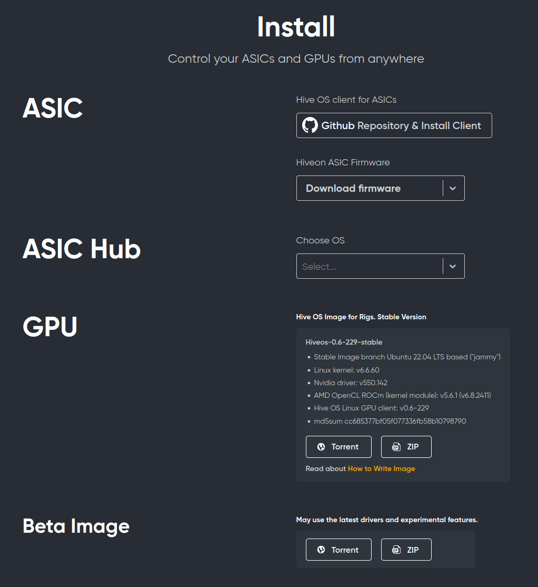
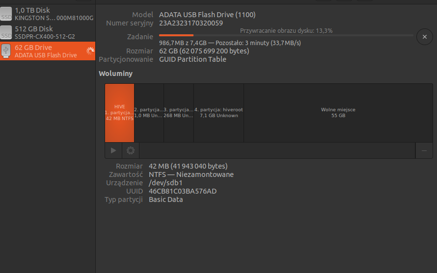
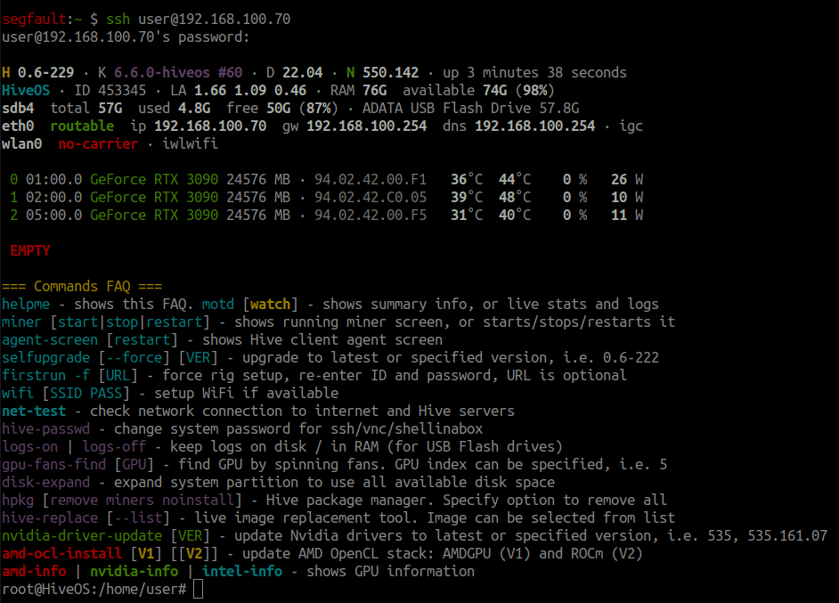
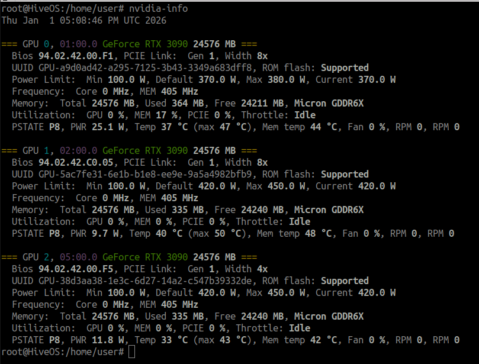
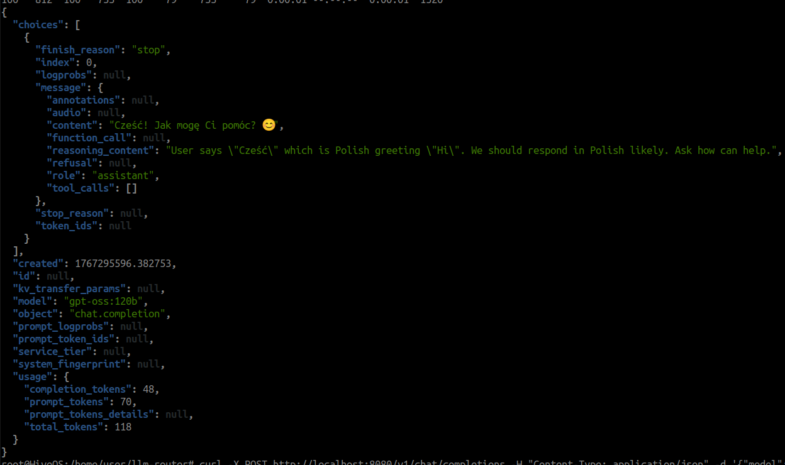

**Today** we’re looking at a slightly different “fairy‑tale”. Not from a production‑side technical perspective, but perhaps a **proposal** for a partial **solution** to the **problem** that’s been discussed in the media—how else we might use “frozen” cryptocurrency mines 😉 for example,[LINK](https://www.benchmark.pl/aktualnosci/odchodza-od-kryptowalut-ai.html)..

Given the demand for computing power required to train models, not every graphics card will be suitable for this purpose (you need cards with a very large amount of VRAM). In this post we’ll show how to turn a USB drive into a **ready‑made** **computational** **environment**, to which we’ll attach an **LLM Router** as a **communication** layer for **generative** **models**.


If you **already have** a ready **environment** for **cryptocurrency mining**, you can safely **skip** the **HiveOS Installation** step. **If** you **don’t**, going through this **step** **helps** to **prepare** the **system**. In the description a **USB** drive is used as the **system** **medium**, because **HiveOS** is **installed by default** on **USB**.

## Intro

How can **llm‑router** help solve this problem? The proposal is actually quite obvious and simple: **use** the **resources** of a **cryptocurrency mining** **farm** as a **provider** for offering **inference** services for **generative models**. In other words, if you **already have** a ready‑made **infrastructure**, this post will show you how to **leverage** it to **run** **generative** **models**. As a result, you’ll have a **locally** **operating** **service** that can launch models such as *gpt‑oss* or *gemma*.

What can you do with this setup? For example, you could **offer** a **paid** **service** that performs **computations** (inference) on those models.

## HiveOS Installation

The first step is to install a ready‑made operating system with the graphics‑card drivers already configured. For example, you can use [HiveOS](https://hiveon.com/) (the standard Ubuntu desktop is also an acceptable option if you don’t want to deal with installing GPU‑driver libraries yourself). The installation process is described in detail on the official site [https://hiveon.com/install](https://hiveon.com/install) – the currently available version is based on Ubuntu 22.04.



We select the GPU (or the beta driver version for the adventurous ;‑)) and install it according to the <strong>*[How to Write Image](https://hiveon.com/install/#howto-image)*</strong> guide. In our example we performed the installation on a USB stick using Ubuntu’s built‑in image‑writing tool (you can also use [balenaEtcher](https://etcher.balena.io/)).



After the installation the default user is `user` and the password is `1`. Of course, it’s good practice to change the default password to something more complex (once you’re logged in to the GPU machine run `passwd`).

## OS configuration

We’ll skip the part where you set up the HiveOS server as a mining RIG (cryptocurrency mining and process monitoring through the HiveOS interface). Instead, we’ll take advantage of the already‑configured system and install a few basic system libraries that are required to run a local instance of **LLM Router** together with a model served via **Ollama**.

The local provider can be any of the following – Ollama, vLLM, llama.cpp – it doesn’t matter; LLM Router is simply an interface that talks to whatever local model‑provider protocol you choose.

After logging into the machine that has HiveOS installed: `ssh user@IP.LOKALNE.MASZYNY` you will see information about the loaded drivers and the available graphics cards, e.g.:



In our case there are three RTX 3090 cards available, each with 24 GB of VRAM. Detailed information about limits, temperatures, etc., can be viewed with the `nvidia‑info` command (for NVIDIA GPUs).



Now we only need to install the basic packages `pip`(for installing dependencies) and **`git`**(for cloning the repository):

```bash
# Installation on the system (if it isn’t already present) git + pip
apt install git python3-pip -y
```

*In fact, those two additional packages are enough for the operating system to be fully configured to run LLM Router.*

## Installing LLM Router

In this example we show how to run the latest version of **LLM Router** natively (i.e., not from a Docker image) directly from the main (`main`) branch.

```bash
# Cloning the repository llm-router
git clone https://github.com/radlab-dev-group/llm-router

# Installation of dependencies and the API
cd llm-router/
pip install -r requirements.txt
pip install .[api]
```

That’s it—in short: download, install, and start with just three commands :). Now, by running: `./run-rest-api-gunicorn.sh` we expose a ready‑made API using **Gunicorn**. At this point no models are attached yet, but the network service (REST API) is already up and running.

### <em>*View the startup log*</em> \[CLICK\]+

```json
root@HiveOS:/home/user/llm-router# ./run-rest-api-gunicorn.sh
2026-01-01 17:59:14,058 INFO main: Starting LLM‑Router API with gunicorn
2026-01-01 17:59:14,065 DEBUG llm_router_api.core.lb.provider_strategy_facade: [provider-monitor] keys to check: []
2026-01-01 17:59:14,072 INFO llm_router_api.core.lb.provider_strategy_facade: [Load balancing] Strategy FirstAvailableStrategy
2026-01-01 17:59:14,072 DEBUG llm_router_api.core.monitor.services_monitor: [services-monitor] thread started
2026-01-01 17:59:14,077 DEBUG llm_router_api.register.auto_loader: Instantiating OpenAICompletionHandlerWOApi
2026-01-01 17:59:14,078 DEBUG llm_router_api.register.auto_loader: Instantiating AnswerBasedOnTheContext
2026-01-01 17:59:14,078 DEBUG llm_router_api.register.auto_loader: Instantiating OpenAICompletionHandler
2026-01-01 17:59:14,078 DEBUG llm_router_api.register.auto_loader: Instantiating OpenAIModelsV1Handler
2026-01-01 17:59:14,078 DEBUG llm_router_api.register.auto_loader: Instantiating ApiVersion
2026-01-01 17:59:14,078 INFO llm_router_api.endpoints.endpoint_i: -> Running LLM-Router version: 0.4.4
2026-01-01 17:59:14,078 DEBUG llm_router_api.register.auto_loader: Instantiating OpenAIResponsesV1Handler
2026-01-01 17:59:14,078 DEBUG llm_router_api.register.auto_loader: Instantiating Ping
2026-01-01 17:59:14,078 DEBUG llm_router_api.register.auto_loader: Instantiating OpenAIResponsesHandler
2026-01-01 17:59:14,078 DEBUG llm_router_api.register.auto_loader: Instantiating ConversationWithModel
2026-01-01 17:59:14,078 DEBUG llm_router_api.register.auto_loader: Instantiating FullArticleFromTexts
2026-01-01 17:59:14,078 DEBUG llm_router_api.register.auto_loader: Instantiating ExtendedConversationWithModel
2026-01-01 17:59:14,078 DEBUG llm_router_api.register.auto_loader: Instantiating GenerateNewsFromTextHandler
2026-01-01 17:59:14,078 DEBUG llm_router_api.register.auto_loader: Instantiating TranslateTexts
2026-01-01 17:59:14,078 DEBUG llm_router_api.register.auto_loader: Instantiating SimplifyTexts
2026-01-01 17:59:14,079 DEBUG llm_router_api.register.auto_loader: Instantiating OllamaTagsHandler
2026-01-01 17:59:14,079 DEBUG llm_router_api.register.auto_loader: Instantiating GenerateQuestionsFromTexts
2026-01-01 17:59:14,079 DEBUG llm_router_api.register.auto_loader: Instantiating LLMStudioChatV0Handler
2026-01-01 17:59:14,079 DEBUG llm_router_api.register.auto_loader: Instantiating OllamaHomeHandler
2026-01-01 17:59:14,079 DEBUG llm_router_api.register.auto_loader: Instantiating FastTextMasking
2026-01-01 17:59:14,079 DEBUG llm_router_api.register.auto_loader: Instantiating VllmChatCompletion
2026-01-01 17:59:14,079 DEBUG llm_router_api.register.auto_loader: Instantiating LmStudioModelsHandler
2026-01-01 17:59:14,079 DEBUG llm_router_api.register.auto_loader: Instantiating OpenAIModelsHandler
2026-01-01 17:59:14,079 DEBUG llm_router_api.register.auto_loader: Instantiating OllamaChatHandler
2026-01-01 17:59:14,079 INFO llm_router_api.register.register: Registered endpoint POST /chat/completions (OpenAICompletionHandlerWOApi)
2026-01-01 17:59:14,079 INFO llm_router_api.register.register: Registered endpoint POST /api/generative_answer (AnswerBasedOnTheContext)
2026-01-01 17:59:14,080 INFO llm_router_api.register.register: Registered endpoint POST /api/chat/completions (OpenAICompletionHandler)
2026-01-01 17:59:14,080 INFO llm_router_api.register.register: Registered endpoint GET /v1/models (OpenAIModelsV1Handler)
2026-01-01 17:59:14,080 INFO llm_router_api.register.register: Registered endpoint GET /api/version (ApiVersion)
2026-01-01 17:59:14,080 INFO llm_router_api.register.register: Registered endpoint POST /v1/responses (OpenAIResponsesV1Handler)
2026-01-01 17:59:14,080 INFO llm_router_api.register.register: Registered endpoint GET /api/ping (Ping)
2026-01-01 17:59:14,081 INFO llm_router_api.register.register: Registered endpoint POST /responses (OpenAIResponsesHandler)
2026-01-01 17:59:14,081 INFO llm_router_api.register.register: Registered endpoint POST /api/conversation_with_model (ConversationWithModel)
2026-01-01 17:59:14,081 INFO llm_router_api.register.register: Registered endpoint POST /api/create_full_article_from_texts (FullArticleFromTexts)
2026-01-01 17:59:14,081 INFO llm_router_api.register.register: Registered endpoint POST /api/extended_conversation_with_model (ExtendedConversationWithModel)
2026-01-01 17:59:14,081 INFO llm_router_api.register.register: Registered endpoint POST /api/generate_article_from_text (GenerateNewsFromTextHandler)
2026-01-01 17:59:14,081 INFO llm_router_api.register.register: Registered endpoint POST /api/translate (TranslateTexts)
2026-01-01 17:59:14,082 INFO llm_router_api.register.register: Registered endpoint POST /api/simplify_text (SimplifyTexts)
2026-01-01 17:59:14,082 INFO llm_router_api.register.register: Registered endpoint GET /api/tags (OllamaTagsHandler)
2026-01-01 17:59:14,082 INFO llm_router_api.register.register: Registered endpoint POST /api/generate_questions (GenerateQuestionsFromTexts)
2026-01-01 17:59:14,082 INFO llm_router_api.register.register: Registered endpoint POST /api/v0/chat/completions (LLMStudioChatV0Handler)
2026-01-01 17:59:14,082 INFO llm_router_api.register.register: Registered endpoint GET / (OllamaHomeHandler)
2026-01-01 17:59:14,082 INFO llm_router_api.register.register: Registered endpoint POST /api/fast_text_mask (FastTextMasking)
2026-01-01 17:59:14,083 INFO llm_router_api.register.register: Registered endpoint POST /v1/chat/completions (VllmChatCompletion)
2026-01-01 17:59:14,083 INFO llm_router_api.register.register: Registered endpoint GET /api/v0/models (LmStudioModelsHandler)
2026-01-01 17:59:14,083 INFO llm_router_api.register.register: Registered endpoint GET /models (OpenAIModelsHandler)
2026-01-01 17:59:14,083 INFO llm_router_api.register.register: Registered endpoint POST /api/chat (OllamaChatHandler)
2026-01-01 17:59:14,083 INFO llm_router_api.core.metrics: [Prometheus] preparing metrics request hooks
2026-01-01 17:59:14,083 INFO llm_router_api.core.metrics: [Prometheus] registering metrics request hooks
[2026-01-01 17:59:14 +0000] [147288] [INFO] Starting gunicorn 23.0.0
[2026-01-01 17:59:14 +0000] [147288] [INFO] Listening at: http://0.0.0.0:8080 (147288)
[2026-01-01 17:59:14 +0000] [147288] [INFO] Using worker: gthread
[2026-01-01 17:59:14 +0000] [147296] [INFO] Booting worker with pid: 147296
[2026-01-01 17:59:14 +0000] [147297] [INFO] Booting worker with pid: 147297
[2026-01-01 17:59:14 +0000] [147298] [INFO] Booting worker with pid: 147298
[2026-01-01 17:59:14 +0000] [147299] [INFO] Booting worker with pid: 147299
2026-01-01 17:59:19,066 DEBUG llm_router_api.core.lb.provider_strategy_facade: [provider-monitor] keys to check: []
```

---

The log contains information from DEBUG mode, so there’s quite a lot of it. This is the default logging level, which can be changed at any time.

## **Sample configuration: Ollama + gpt‑oss:120b**

Now we’ll move on to installing Ollama with the 120‑billion‑parameter model (gpt‑oss:120b) made available. The model is quite large, requiring three RTX cards with 24 GB of VRAM each. Ollama can run this model very well on three cards while maintaining almost full context‑length support.

We stop the running LLM Router instance (CTRL +C) and install Ollama—the installation is straightforward; just invoke the official installation script from the console:

```bash
curl -fsSL https://ollama.com/install.sh | sh
```

After a short while (depending on your internet connection), Ollama will be ready and you need to load a local model onto it. A detailed guide on how to do this locally is available on the model’s page: [https://ollama.com/library/gpt-oss](https://ollama.com/library/gpt-oss). All you have to do is:

```text
ollama run gpt-oss:120b
```

After the download finishes, the model is immediately available in the local Ollama instance.

> **NOTE!**
>
> The `gpt-oss:120b` model available through Ollama is a quantized version of OpenAI’s gpt‑oss‑120b. Despite the heavy quantization, the model is still very large—it occupies roughly **65 GB on disk** (and the same amount in GPU memory). Consequently, the USB drive must be sufficiently large to store the model locally (or you can mount an external drive that already contains the model).

**OPTION:** If the model has already been downloaded and is available over the network, you can attach the model from a network drive instead of copying it to a USB stick. Below is an example of how to run the model on three GPUs when the model is stored on a network share (e.g., via nfs) from a directory `/mnt/data2/llms/models/ollama/.ollama/models/`:

```text
CUDA_VISIBLE_DEVICES=0,1,2 \
  OLLAMA_NOPRUNE=true \
  OLLAMA_CONTEXT_LENGTH=128000 \
  OLLAMA_MODELS=/mnt/data2/llms/models/ollama/.ollama/models/ \
  OLLAMA_HOST=0.0.0.0 \
  ollama serve
```

To see which models are available in Ollama, simply run the command `ollama list`. For example, in our setup (with a mounted network drive):

```text
root@HiveOS:/home/user/llm-router# ollama list
NAME                           ID              SIZE      MODIFIED
dolphin-mistral:latest         5dc8c5a2be65    4.1 GB    5 days ago
dolphin3:8b                    d5ab9ae8e1f2    4.9 GB    6 days ago
devstral-2:latest              524a6607f0f5    74 GB     6 days ago
devstral-2:123b                524a6607f0f5    74 GB     6 days ago
deepseek-r1:70b                d37b54d01a76    42 GB     4 weeks ago
gemini-3-pro-preview:latest    91a1db042ba1    -         4 weeks ago
gpt-oss:120b-ctx32k-rope       c265a9f5b5de    65 GB     7 weeks ago
gpt-oss:120b-ctx250k           964592b444fd    65 GB     7 weeks ago
glm-4.6:cloud                  05277b76269f    -         8 weeks ago
qwen3-coder:30b                06c1097efce0    18 GB     2 months ago
qwen3:235b                     72840bddff91    142 GB    3 months ago
gpt-oss:120b                   f7f8e2f8f4e0    65 GB     4 months ago
gpt-oss:20b                    aa4295ac10c3    13 GB     4 months ago
```

## LLM Router Configuration for gpt‑oss:120b

Alright, we now have the system set up, the router downloaded, and the model loaded into Ollama. It’s time to connect the model to the router. The previous commands start the model on the same machine where the llm‑router is running. To simplify the demonstration, we also provide a ready‑made configuration file that can be plugged into the router (it will overwrite the default configuration file):

- You can either edit the startup script run‑rest‑api‑gunicorn.sh and change the default path to the configuration (the variable LLM\_ROUTER\_MODELS\_CONFIG ),
- or, even more simply, pass the path to the prepared configuration when launching the router process. In other words, just issue the following command:

```text
LLM_ROUTER_MODELS_CONFIG=resources/configs/specific/models-config-local-ollama.json ./run-rest-api-gunicorn.sh
```

That’s basically it 🙂 You can now query the router by specifying the model name. Here’s an example using `curl` with JSON formatting via `jq`:

```bash
curl -X POST http://localhost:8080/v1/chat/completions -H "Content-Type: application/json" -d '{"model": "gpt-oss:120b", "messages": [{"role": "user", "content": "Cześć"}]}' | jq
```

which should produce a result similar to:



## Outro

These few steps are enough to get the LLM Router up and running on typical cryptocurrency‑mining hardware and operating systems, leveraging those resources. Of course, this is just an example; the repository contains many more model configurations and ways to connect to various local providers.

**Miners, this is your second chance! 🙂**

Happy New Year! Take care of your data and avoid sending sensitive information to the cloud!
