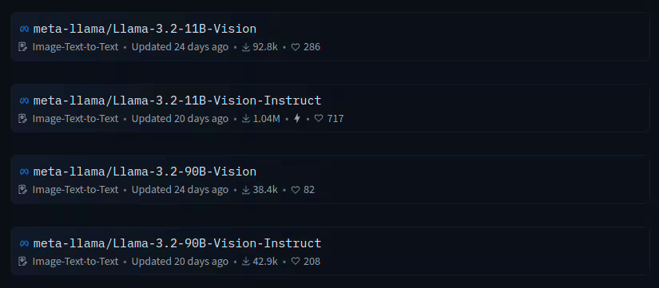
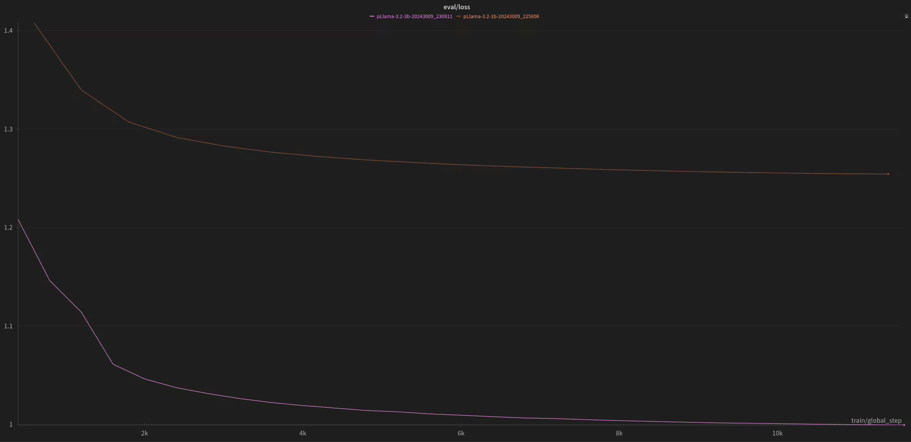
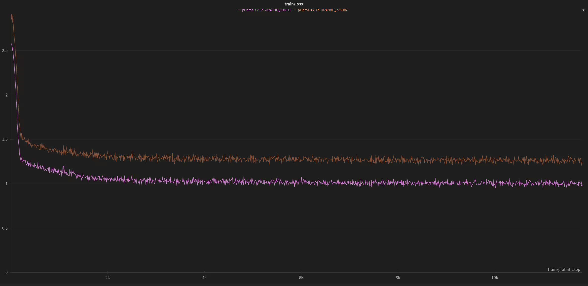
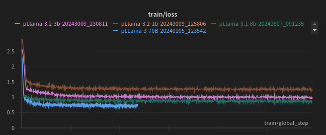
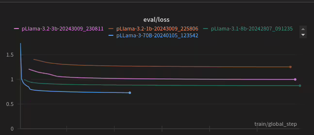

*pLLama – generated using AI*

## Intro

Today a very short post. A post about a model, small by today’s standards. You’ve probably heard about Llama 3.2 from Meta AI? Meta recently released models for content generation (*Instruct*) and images (*Vision-Instruct*).

Unfortunately, the *Vision-Instruct* models are not available in the European Union, and by extension, in our country.

So… what are we left with? We are left with teaching small text models in 1B and 3B architecture in Polish 😉

## Data and Training

For further training, we first used the fine-tuning technique, and then in the DPO process, we trained both models for language correction. The data was exactly the same as for pLLama3 ([Click to read the article](https://radlab.dev/2024/08/16/pllama3-8b-70b-genai-dla-polskiego/)). This applies to both the fine-tuning and DPO. The only change was a small adjustment in the learning hyperparameters (batch size, learning rate). The number of epochs in FT was 5, and the number of steps in DPO was 50k. And… oh yes, training in 16-bit 🙂

See for yourself the loss function chart for both the training and evaluation parts (it’s the same fine-tuning process for the Polish language):

And that’s exactly the difference between them 🙂

## Feelings

Since the 1B and 3B models are distilled versions of existing models, likely trained mostly on English data, I was curious about the result of fine-tuning and DPO training for these models. The 1B model (after both FT and DPO) is, without a doubt, the least capable model in our collection—but Meta’s own benchmarks show exactly the same. As for the 3B model, it’s a completely different tier than the 1B. One could say it performs as expected.

Comparing them to larger models somewhat misses the point, because with the 1B and 3B, Meta focused on making them runnable on less powerful hardware, even on a smartphone 😉. While the 1B model struggles, the 3B model can be surprisingly effective.

## Models for Download

We invite you to our HuggingFace page, where we have created a collection with the  *[pLLama3.2 Models](https://huggingface.co/collections/radlab/pllama32-models-6710bdf9eac198072676a52f)*. All models are, of course, publicly available for free:

- 1B architecture models: radlab/pLLama3.2-1B – the model after fine-tuning only, and radlab/pLLama3.2-1B-DPO after FT + DPO
- 3B architecture models: radlab/pLLama3.2-3B the model after fine-tuning only, and radlab/pLLama3.2-3B-DPO after FT + DPO

Bon appetit 🙂

## **What next?**

> Next will be not-in-or-de-r: pLLama3.1-8B (the green graph) and L31 as an interesting mix…

