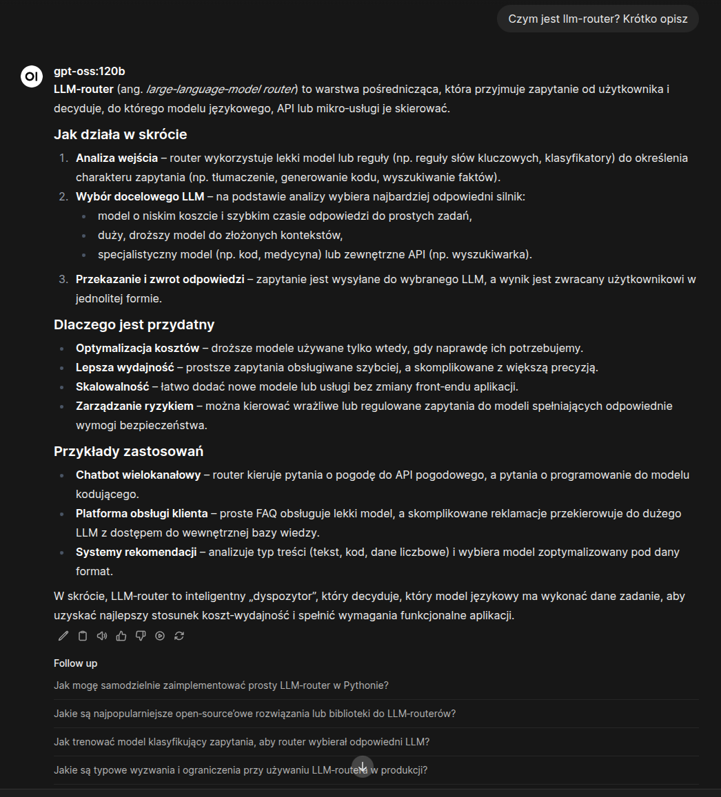
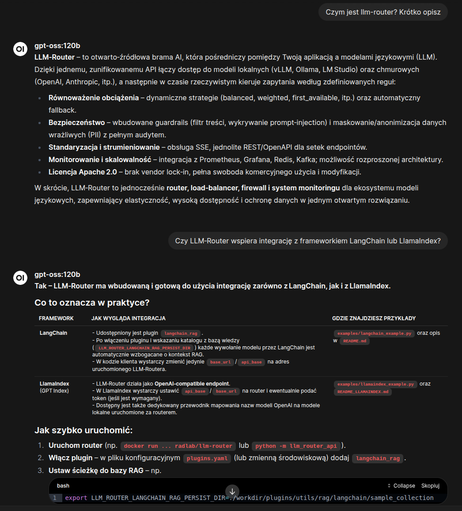

Jak najbardziej, wystarczy `langchain_rag` podpięty do [`llm-routera`](https://llm-router.cloud/) 😉


## Intro

Witajcie! Dzisiaj pokazujemy dodatkowe możliwości[ LLM Routera ](https://llm-router.cloud/)w postaci pluginów, a właściwie to jednego pluginu `langchain_rag`. Jest to wtyczka, która tworzy lokalną bazę wiedzy z przekazanych w procesie indeksacji treści. Wykorzystuje znane rozwiązania jak `langchain` do tworzenia systemu ragowego oraz `fais` jako wektorowa baza wiedzy. Następnie utworzoną bazę wiedzy można podpiąć do dowolnego zapytania w LLM routerze, bez modyfikacji aplikacji, która aktualnie wykorzystuje modele generatywne. Co daje takie podejście?

Możliwość automatycznego wzbogacenia kontekstu przekazywanego do modelu generatywnego – czyli standardowe podejście [RAG](https://radlab.dev/2024/08/04/rag-i-problemy/). Wystarczy zaindeksować wybrane przez siebie dokumenty za pomocą dostępnej komendy CLI `llm-router-rag-langchain index [OPTIONS]` i wszystkie te treści dostępne są dla modelu generatywnego podczas generowania odpowiedzi.

> Co to daje?

Możliwość automatycznego wzbogacenia kontekstu przekazywanego do modelu generatywnego – czyli standardowe podejście

RAG

. Wystarczy zaindeksować wybrane przez siebie dokumenty za pomocą dostępnej komendy CLI

llm-router-rag-langchain index \[OPTIONS\]

i wszystkie te treści dostępne są dla modelu generatywnego podczas generowania odpowiedzi.
>
> — Możliwość automatycznego wzbogacenia kontekstu przekazywanego do modelu generatywnego – czyli standardowe podejścieRAG. Wystarczy zaindeksować wybrane przez siebie dokumenty za pomocą dostępnej komendy CLIllm-router-rag-langchain index [OPTIONS]i wszystkie te treści dostępne są dla modelu generatywnego podczas generowania odpowiedzi.

## Indeksacja

Indeksacja danych to krok, w którym z zadanego katalogu, pliki z zadanymi rozszerzeniami zapisywane są w lokalnej bazie wiedzy. Plugin **bazy wiedzy** wykorzystuje załadowany model embeddera (domyślnie skonfigurowany jest `google/embeddinggemma-300m`) którym tworzy wektorowe reprezentacje pochunkowanych tekstów i zapisuje je do lokalnie utworzonej **bazy** **wektorowej** **FAISS**. To użytkownik wybiera jakie **dokumenty** chce wykorzystać **do** **wzbogacania** **kontekstu** oraz w jakich kolekcjach mają się znaleźć. Jest to o tyle istotny krok, ponieważ to od zawartości tej **bazy** zależny **trafność** **odpowiedzi** **modelu** generatnywnego. Pomimo istotności **proces** jest bardzo **prosty**. Po instalacji llm-routera dostępna jest **komenda** do obsługi bazy wiedzy tej wtyczki: `llm-router-rag-langchain`. Komenda instaluje się w CLI więc **dostępna** jest z poziomu **dowolnego** **katalogu** routera. W poruszanym dzisiaj przykładzie jako baza wiedzy wykorzystaliśmy wszystkie opisy ze wszystkich repozytorium i pod-repozytoriów LLM Routera:

- Główne repozytorium llm-routera : pliki md i txt ;
- Repozytorium z pluginami (również z opisywanym pluginem) – pliki w formacie md , txt ;
- Serwisy z obsługą pluginów typu guardrails i maskers – md i txt ;
- Repozytorium z przykładowymi narzędziami wykorzystującymi llm-router – pliki md oraz txt ;
- Dedykowane interfejsy graficzne dla Anonimizatora i Configs Managera – również pliki md i txt ;
- Strona internetowa llm-router.cloud – pliki html , md oraz txt ;

Dla uproszczenia sprawy dodaliśmy prosty skrypt bashowym, w którym wystarczy zmienić typy plików oraz ścieżki do indeksacji i bez modyfikacji pozostałych ustawień z głównego katalogu routera wydać polecenie \[[tutaj](https://github.com/radlab-dev-group/llm-router/blob/main/scripts/llm-router-rag-langchain-index.sh) pełen skrypt\]:

```text
bash scripts/llm-router-rag-langchain-index.sh
```

Dzięki temu w domyślnie ustawionym katalogu: `workdir/plugins/utils/rag/langchain/sample_collection/` zapisana będzie lokalna baza wiedzy, którą następnie można podpiąć jako baza wiedzy llm-routerze.

## Uruchomienie bazy wiedzy w LLM Routerze

Baza wiedzy wczytywana jest domyślnie z katalogu, w którym uruchomiony jest LLM Router, jednak miejsce zapisu/wczytania może być dowolnie ustawione zmienną systemową `LLM_ROUTER_LANGCHAIN_RAG_PERSIST_DIR`.  Aby LLM Router obsługiwał utworzoną bazę wiedzy, należy aktywować plugin `langchain_rag` oraz ustawić ścieżkę do utworzonej bazy wiedzy. Po uruchomieniu routera z taką konfiguracją, każde zapytanie do modelu generatywnego będzie wzbogacane o kontekst pochodzący z podpiętej bazy wiedzy. Aktywacja wtyczki to po prostu wyeksportowanie zmiennej środowiskowej z pluginami typu utils przy starcie routera (domyślny [skrypt](https://github.com/radlab-dev-group/llm-router/blob/main/run-rest-api-gunicorn.sh) umożliwia modyfikacje):

```text
export LLM_ROUTER_UTILS_PLUGINS_PIPELINE="langchain_rag"
```

I to właściwie tyle, jeżeli nie modyfikujemy parametrów jak wielkość kontekstu, embedder, to nic nie trzeba zmieniać i ustawiać – tylko indeksować własne dane 🙂 A jak to wygląda w praktyce. Poniżej na zdjęciu odpowiedź modelu bez podpiętej wtyczki *langchain\_rag* z zaindeksowanymi treściami:



Oraz odpowiedź z podpiętą wtyczką:



## Outro

A na zakończenie jeszcze filmik z konsoli, jak zaindeksować wspomniane treści:



oraz przełączanie routera do działania w trybie bazy wiedzy (początek filmu, to działanie routera bez bazy wiedzy, druga część filmu, to działanie z podpiętą bazą wiedzy):



W roli głównej: *OpenWeb UI* z podpiętym *LLM-Routerem* (z *wyłączoną* i *włączoną* wtyczką *langchain\_rag*).

**Zachęcamy do pobierania, sprawdzania oraz dzielenia się swoimi odczuciami z wykorzystywania 🙂**

---

> **Zobacz powiązane produkty:** Wzbogacanie kontekstu w oparciu o bazę wiedzy jest natywnie wspierane przez ekosystem wtyczek bramy [LLM Router](/products/llm-router/). Sprawdź także demonstrację działania na żywo w [RDL Playground AI](/products/playground/).
