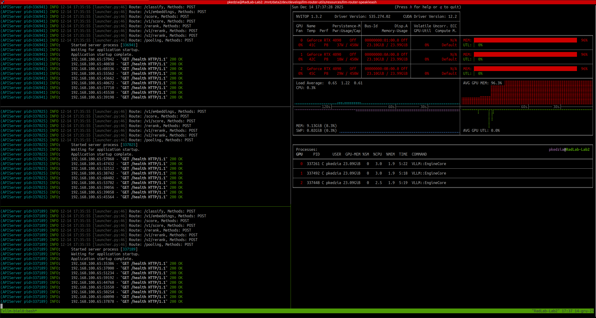
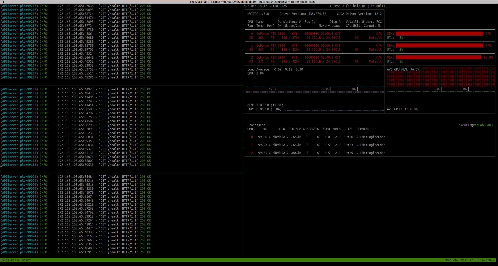
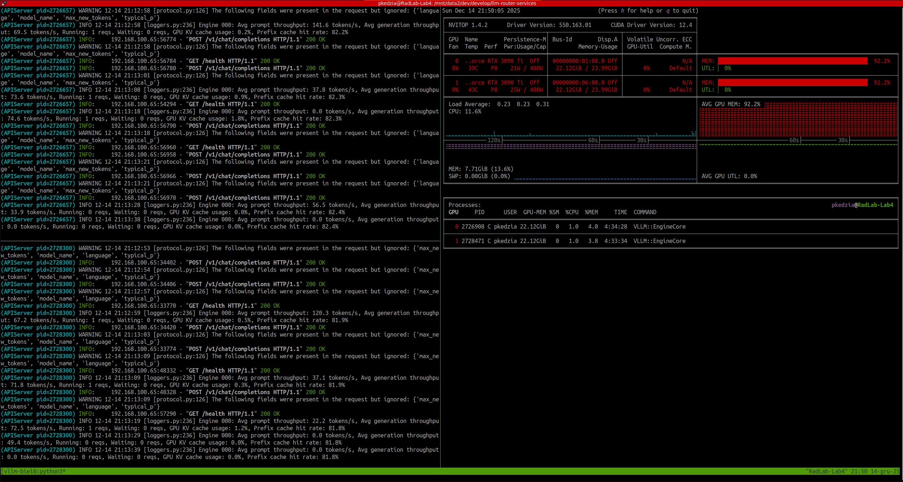
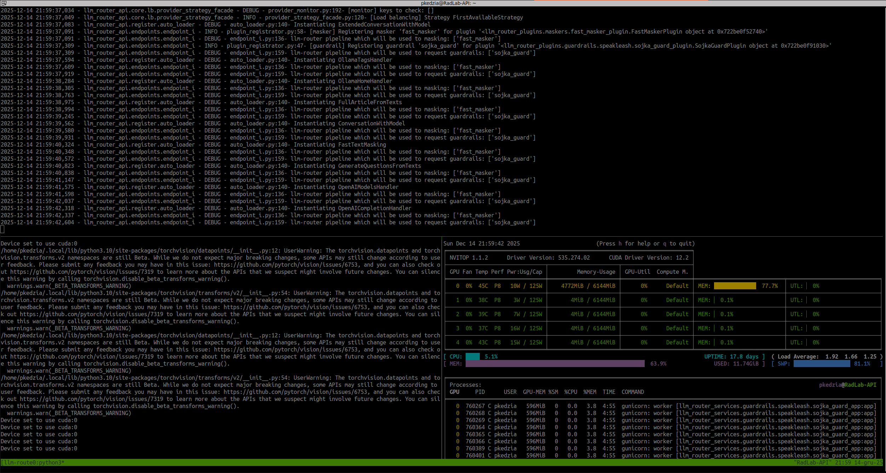

> Nie wiem, choć się domyślam \[[…](https://www.youtube.com/watch?v=ZECKxkfKkY8)\]

Witajcie! Dzisiaj przybywamy po dwóch miesiącach intensywnej pracy nad upublicznieniem [LLM Routera](https://llm-router.cloud/). Tutaj wcześniejszy wpis: [klik](https://radlab.dev/2025/10/13/llm-router/). Z małego projektu wyszedł spory moloch, w którego rozwój nie tylko deweloperski zaangażowały się nowe osoby. Oprócz [Michała](https://techsky.pl/) i [Bartka](https://evaluation.pl/), pojawili się [Krzysiek](https://codee.dev/) i [Maciek](https://www.shgrowth.com/). Robi się niezły *set skillsów*<strong>…</strong> 😉


W dzisiejszym wpisie przedstawiamy w jaki sposób można skonfigurować LLM Router wykorzystując do tego celu dostępne modele na licencji Apache 2.0. Wielkie dzięki dla fundacji **[Speakleash](https://speakleash.org/)**, która w ramach swojej działalności udostępniła dwa modele, które idealnie nadają się do wykorzystania w routerze. W tym wpisie pokazujemy jak można podpiąć modele [Bielik-11B-v2.3-Instruct](https://huggingface.co/speakleash/Bielik-11B-v2.3-Instruct) oraz [Bielik-Guard-0.1B-v1.0](https://huggingface.co/speakleash/Bielik-Guard-0.1B-v1.0) aby współgrały w LLM Routerze. Pokazaliśmy przykład, jak **8 Bielików** i **5 Sójek** może ze sobą współpracować w wirtualnym ekosystemie 🙂

## Bieliki i Sójki w jednym gnieździe

W naturze *Orzeł* Bielik, to samotny drapieżca, który na czas godów łączy się w pary. Nie dopuszcza do swojego terytorium obcego ptactwa. W kontekście Sójki jest prosta relacja: drapieżca – ofiara. Jednak… to „tylko” natura, a w świecie cyfrowym można więcej.

### Metafora Ekosystemu natury

W świecie cyfrowym miano *Bielika* przejmuje model językowy [Bielik-11B-v2.3-Instruct](https://huggingface.co/speakleash/Bielik-11B-v2.3-Instruct), ofiarą jest *Sójka* – [Bielik-Guard-0.1B-v1.0](https://huggingface.co/speakleash/Bielik-Guard-0.1B-v1.0) typu guardrail, a *gniazdem* [LLM Router](https://llm-router.cloud/), który w swoim ekosystemie wprowadza ład i harmonię, a zależność drapieżca – ofiara przestaje istnieć. Wręcz przeciwnie, te gatunki zaczynają razem tworzyć liczne stada, a niechciana zwierzyna nie ma wstępu. W konglomeracie modeli *Instruct* i *Guardrail* wspomaganych t*echnikami maskowania danych wrażliwych* otrzymujemy idealne rozwiązanie do kontrolowanego wykorzystywania modeli językowych typu generatywnego. Lokalnie uruchomiony router umożliwia kontrolę treści wysyłanych do modeli generatywnych. Ofiara ze świata *natury* staje się obrońcą, model językowy komunikuje się z aplikacją, zaś mechanizmy maskowania w tle zamazują dane wrażliwe. Ten konglomerat, to właśnie opisywane dzisiaj rozwiązanie w *LLM Router*ze 😉

### Kilka słów o LLM Routerze

> Pełen opis LLM Routera znajduje się [stronie domowej llm-router.cloud](https://llm-router.cloud/) oraz w poprzednim [wpisie na blogu](https://radlab.dev/2025/10/13/llm-router/).

LLM Router, to rozwiązanie**on-prem**, którego zadaniem jest **kontrola** i **optymalizacja** **ruchu** do modeli generatywnych. W odróżnieniu od większości *routerów* nie optymalizujemy tutaj kosztu odpytania api, a wręcz przeciwnie – mając do dyspozycji providerów (lokalnych i chmurowych) chcemy tak rozłożyć ruch, aby czas odpowiedzi był jak najmniejszy. W całym procesie następują jeszcze dodatkowe kroki, takie jak **sprawdzanie** wysyłanej **treści** pod względem *etyki* oraz *danych wrażliwych*. Poprawność *etyczna* wysyłanych treści kontrolowana jest poprzez mechanizmy typu **Guardrails**, w momencie wykrycia incydentu, rozmowa/wiadomość **automatycznie** **jest** **blokowana**, tworzony jest **audyt**, do modelu generatywnego nie jest wysyłana żadna treść, a aplikacja otrzymuje informację, że treść jest **zablokowana** i nie jest możliwa dalsza kontynuacja rozmowy. Zaś mechanizmy **maskowania** działają w tle i mają za zadanie zamaskowanie **informacji** **wrażliwych** **przed** **wysłaniem** do modelu generatywnego – ten mechanizm **nie** **blokuje** wiadomości, w locie **podmienia** ją na zamaskowaną, odkłada **audyt** o wykrytym incydencie i wysyła do modelu generatywnego zamaskowaną wiadomość. Całość konfigurowalna jest poprzez odpowiednie ustawienie uruchamianego routera.

---

## Bieliki i Sójki w LLM Routerze

Aby wspomniany ekosystem mógł poprawnie działać, musimy odpowiednio przygotować to środowisko. Do tego celu potrzebujemy kilku elementów:

- llm-router – główny ekosystem koordynowania ruchu (dokładny opis znajduje się na gitgubie i www );
- llm-router-services – serwisy, w których uruchamiane są modele typu guardrails (przykład z Bielik-Guard );
- model Bielik-11B-v2.3-Instruct – polski model generatywny;
- model Bielik-Guard-0.1B-v1.0 – model typu guardrail działający na tekstach w języku polskim;

Następnie poszczególne elementy wystarczy poskładać w jednym miejscu – konfiguracji LLM Routera. Aby wpis nie był zbyt długi, wszystkie konfiguracje wrzuciliśmy na githuba: [tutaj](https://github.com/radlab-dev-group/llm-router-utils/tree/main/resources/llm-router-speakleash), tam też umieściliśmy kompletny opis wszystkich kroków. Jednak w skrócie:

1. Uruchomienie serwisu z Sójką (pięć Sójek jednocześnie pilnuje treści);
2. Uruchomienie Bielika na vLLM (8 providerów z tym samym modelem), na GPU cuda:0 , cuda:1 , cuda:2 ;
3. Konfiguracja i uruchomienie LLM Routera;

W podanym przykładzie uruchomiliśmy proces [audytowania](https://github.com/radlab-dev-group/llm-router/tree/main/llm_router_api/core/auditor) i blokowania treści niedozwolonych oraz [audytowania](https://github.com/radlab-dev-group/llm-router/tree/main/llm_router_api/core/auditor) i maskowania danych wrażliwych wbudowanym mechanizmem *fast\_masker* ([opis reguł maskujących](https://github.com/radlab-dev-group/llm-router-plugins/tree/main/llm_router_plugins/maskers/fast_masker) oraz ich [implementacje](https://github.com/radlab-dev-group/llm-router-plugins/tree/main/llm_router_plugins/maskers/fast_masker/rules) w [pluginach routera](https://github.com/radlab-dev-group/llm-router-plugins/tree/main)).

---

## Podgląd na ekosystem

Poniżej znajdują się screeny uruchomionego `nvitopa` na każdym z hostów oraz podgląd na konsolę API

Host *Lab2* z odpalonymi trzema modelami Bielika (w vLLM)



Host *Lab3* również trzema z odpalonymi modelami Bielika (vLLM)



Host *Lab4* z dwoma modelami Bielik (vLLM)



Host z API routera (4 workery gunicorna, po 16 wątków) i pięcioma Sójkami (5 workerów gunicorna na cuda:0)



Tak skonfigurowane środowisko gotowe jest do przyjmowania dziesiątek zapytań 🙂 Dla testów wydajności przygotowaliśmy prostą aplikację, której zadaniem jest przetłumaczenie zadanego tekstu na język polski. Do tego wykorzystaliśmy wbudowany endpoint z llm-routera `/api/translate` a zbiór do tłumaczenia, to [marmikpandya/mental-health](https://huggingface.co/datasets/marmikpandya/mental-health) dostępny na huggingface. Do przeprowadzenia testu wykorzystaliśmy aplikację [run-text-translator.sh](https://github.com/radlab-dev-group/llm-router-utils/blob/main/run-text-translator.sh) z repozytorium z [utilsami](https://github.com/radlab-dev-group/llm-router-utils), po instalacji biblioteki dostępna jest komenda w CLI `translate-texts`:



```bash
$ translate-texts --help
usage: translate-texts [-h] --llm-router-host LLM_ROUTER_HOST --model MODEL --dataset-path DATASET_PATH [--dataset-type {json,jsonl}] [--accept-field ACCEPT_FIELD] [--num-workers NUM_WORKERS] [--batch-size BATCH_SIZE]

options:
  -h, --help            show this help message and exit
  --llm-router-host LLM_ROUTER_HOST
                        Base URL of the LLM router service (e.g., http://localhost:port)
  --model MODEL         Model name to use for translation (e.g., speakleash/Bielik-11B-v2.3-Instruct)
  --dataset-path DATASET_PATH
                        Path to a dataset file. This option can be provided multiple times to process several files.
  --dataset-type {json,jsonl}
                        Explicit type of dataset files (json or jsonl). If omitted, the type is inferred from each file's extension.
  --accept-field ACCEPT_FIELD
                        Name of a field to retain from each record. Can be supplied multiple times; if omitted all fields are kept.
  --num-workers NUM_WORKERS
                        Number of worker threads for parallel translation (default: 1 – runs sequentially).
  --batch-size BATCH_SIZE
                        How many texts to send in a single request to the router (default: 8).
```



Na filmiku poniżej pokazaliśmy działanie routera w połączeniu we wspomnianymi wcześniej modelami. Na początku (pierwsze 3 sekundy), to widok na maszynę *API* (w górnej części) z llm-routera, dolna lewa część to uruchomiony serwis z Sójkami, zaś prawa dola część to podgląd nvitopem na kraty graficzne. Sekundy 3-6 to podgląd na maszynę *Lab4* z dwoma Bielikami (z lewej strony uruchomione vLLMy, z prawej podgląd na utylizację kart graficznych). Kolejne sekundy 6-10 to podgląd na maszynę *Lab3* z trzema Bielikami. Sekundy 11-13 to podobny podgląd na obciążenie maszyny *Lab2* (trzy Bieliki). Kolejne sekundy, to przełączanie między maszynami, zaś końcówka to podgląd na *API*.



Podczas pracy, mechanizm maskowania i wykrywania treści niedozwolonych wyłapał przypadki, które zamaskował, zablokował oraz zaudytował do pliku (w logach pojawiają się wpisy `[AUDIT]************`. Audytowana treść zapisywana jest w wydzielonym katalogu (innym niż logi główne) i szyfrowana jest kluczem publicznym GPG. Całość możliwa jest do odkodowania tylko poprzez prywatny klucz. Na poniższym filmiku pokazujemy w jaki sposób przechowywane są logi (pliki z rozszerzeniem `.audit`) oraz jak odkodować je z wykorzystaniem dostępnego w repozytorium llm-routera skryptu do deszyfracji `scripts/decrypt_auditor_logs.sh`. A oto efekt wykonania komendy

```bash
$ bash scripts/decrypt_auditor_logs.sh
```

z ustawionym dodatkowo hasłem na klucz deszyfrujący:



## Outro

W ten oto sposób w wirtualnym świecie zastał porządek. Sójki pilnują treści wysyłanych do modeli generatywnych, Bieliki generują treść, mechanizmy maskowania ukrywają treści wrażliwe a audytorzy na bieżąco monitorują całość pod względem bezpieczeństwa.

Oczywiście zachęcamy do pobierania i testowania rozwiązania! Wszystko dostępne na Apache 2.0. Dobrego maskowania! 😉
