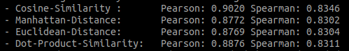

## Wstęp

Możliwości płynące z wykorzystania modeli generatywnych są ogromne, wystarczy spojrzeć na sukces [OpenAI](https://openai.com/) i flagowego produktu [ChatGPT](https://chat.openai.com). Modele generatywne oparte o architekturę transformers dorównują człowiekowi w zakresie tworzenia contentu, czy to tekstowego, czy w formie zdjęć, czy też bardziej skomplikowanych animacji. Pomimo potężnych możliwości *generatywnych* mają one podstawową wadę: aktualizacja informacji w tych modelach. Odpytując taki model o informacje ze świata codziennego, które wykraczają poza zbiór uczący, praktycznie nie jest możliwe, aby model udzielił prawidłowej odpowiedzi. Jednym z rozwiązań tego problemu, jest podejście oparte o Retrieval Augmented Generation (RAG).

## Retrieval Augmented Generation

Idea RAGa polega na odseparowaniu od modelu generatywnego warstwy *informacyjnej*. Warstwa informacyjna, to jakaś forma bazy danych, w której zapisane są informacje, zaś model generatywny jest wykorzystywany do udzielania odpowiedzi na podstawie wyszukanych w bazie informacji. Co daje takie podejście? Bardzo dużo. Wprowadza to pewien przełom w NLP, gdzie wykorzystywane wcześniej podejścia Retrieval Information (zastąpione przez nowe mechanizmy), połączone z dobrze działającymi modelami generatywnymi, są w stanie udzielać najświeższych informacji. Ponieważ informacje te zapisywane są w bazie, mogą być na bieżąco aktualizowane. W momencie, kiedy jakaś informacja staje się nieaktualna, wystarczy *usunąć* ją z bazy. W skutek czego, model generatywny przy udzielaniu odpowiedzi nie otrzyma tej informacji jako kontekstu do udzielenia odpowiedzi, co ograniczy halucynacje tego modelu.

## Maszyneria

W takim razie co jest potrzebne, aby zrealizować podejście RAG? W najprostszym przypadku jest to kilka działających mechanizmów:

- mechanizm konwertujący tekst do postaci wektorowej (dalej zwany embedderem );
- baza danych, która umożliwia przechowywanie i przeszukiwanie zaindeksowanych tekstów (np. Milvus );
- model generatywny, który będzie udzielał odpowiedzi na podstawie dostarczonego kontekstu (np. LLama3 od MetaAI ).

W bardziej skomplikowanych przypadkach kontroluje się nie tylko proces wyszukiwania informacji, ale również sam zbiór tekstów, które zostały zwrócone przez wyszukiwarkę.

## Model embeddera i rerankera

W dzisiejszym wpisie chcemy zaprezentować nasze dwa modele. Pierwszy z nich to *[embedder](https://huggingface.co/radlab/polish-bi-encoder-mean)*, który można wykorzystać do transformacji tekstu w postać wektorową. Drugi, to mechanizm *[rerankingujący](https://huggingface.co/radlab/polish-cross-encoder)* wyniki zwrócone przez wyszukiwarkę semantyczną. Techniczna różnica między *embedderem* (bi-encoderem), a *rerankerem* (cross-encoderem) jest bardzo dobrze przedstawiona w [tym artykule](https://sbert.net/examples/applications/cross-encoder/README.html). W telegraficznym skrócie: model *bi-encodera* uczymy na proces podobieństwa semantycznego, gdzie funkcja oceny to wskazana odległość semantyczna, w naszym przypadku miara kosinus-kąta. Zaś w przypadku cross-encodera, model uczony jest wartością funkcji straty, wynikającą z korelacji odpowiedzi modelu w stosunku do zbioru testowego.

Do budowy tych modeli wykorzystaliśmy bibliotekę [sentence-transformers](https://sbert.net/). Funkcja straty dla modelu bi-encodera, to odległość kosinusowa, dla cross-encodera [CECorrelationEvaluator](https://github.com/yym6472/ConSERT/blob/master/sentence_transformers/cross_encoder/evaluation/CECorrelationEvaluator.py). Jako zbiór danych wykorzystaliśmy istniejące zbiory do information-retrieval np. [ipipan/maupqa](https://huggingface.co/datasets/ipipan/maupqa), które wzbogaciliśmy o nasz zbiór [radlab/polish-sts-dataset](https://huggingface.co/datasets/radlab/polish-sts-dataset). Oczywiście w obu przypadkach należało odpowiednio przekształcić te zbiory i dostosować do problemu uczenia bi-encodera i cross-encodera.

### bi-encoder

Model bi-encodera, na jednej karcie NVIDIA GeForce RTX 4090 uczył się przez 1 dzień 9 godzin. Wartości korelacji Pearsona i Spearmana, mierzone na zbiorze ewaluacyjnym przedstawiają się następująco:



To, co z naszej perspektywy jest najbardziej interesujące, to korelacja dla *Cosine-Similariy*. Wartości korelacji są wysokie i w obu przypadkach ich interpretacja jest jako silna i dość silna korelacja. Co oznacza, że odpowiedzi modelu silnie korelują z danymi testowymi. Opublikowany model bi-encodera, posiada uśrednioną warstwą poolingu. Można go wykorzystać do tworzenia embeddingów z tekstu i semantycznego ich porównywania. Link do modelu na huggigface: [radlab/polish-bi-encoder-mean](https://huggingface.co/radlab/polish-bi-encoder-mean).

Przykładowy kod do załadowania modelu za pomocą sentence-transformers, który dla wskazanych tekstów stworzy reprezentację wektorową:

```python
from sentence_transformers import SentenceTransformer
sentences = ['Ala ma kota i psa, widzi dzisiaj też śnieg', 'Ewa ma białe zęby']

model = SentenceTransformer('radlab/polish-bi-encoder-mean')
embeddings = model.encode(sentences)
print(embeddings)
```

### cross-encoder

Udostępniliśmy również model *cross-encodera*, który zwraca wartość relewantności dwóch tekstów. Można go wykorzystać oczywiście jako *reranker* np. w wyszukiwarce semantycznej. Jak taki proces może wyglądać? Jak zwykle – prosto 🙂

Jako wynik wyszukiwania semantycznego, dostajemy pewien zbiór tekstów, który uszeregowany jest względem wartości podobieństwa jednego fragmentu tekstu, do innego – tego wyszukiwanego. Ten zbiór jest idealnym wejściem dla modelu, którego celem jest określenie nie tylko podobieństwa między dwoma fragmentami tekstów, ale również stwierdzenie, który fragment lepiej dopasowuje się do wyszukiwanego tekstu.

Gotowy model rerankingujący, również udostępniliśmy na huggingface w repozytorium [radlab/polish-cross-encoder](https://huggingface.co/radlab/polish-cross-encoder) Model ten uczony był na jednej karcie NVIDIA GeForce RTX 4090 przez 3 dni i 10 godzin. Korelacja Pearsona i Spearmana na zbiorze testowym:

- Pearson Correlation : 0.9360742942528038
- Spearman Correlation : 0.8718174291678207

Wartości obu korelacji, podobnie jak w przypadku bi-encodera są interpretowane jako silna i dość silna korelacja odpowiedzi modelu ze zbiorem testowym.

Przykładowy kod (z wykorzystaniem sentence-transformers), który przyporządkowuje odpowiedzi do pytania:

```json
from sentence_transformers.cross_encoder import CrossEncoder

model_path = "radlab/polish-cross-encoder"
model = CrossEncoder(model_path)

questions = [
    "Jaką mamy dziś pogodę? bo Andrzej nic nie mówił.",
    "Gdzie jedzie Andrzej? Bo wczoraj był w Warszawie.",
    "Czy oskarżony się zgadza z przedstawionym wyrokiem?",
]
answers = [
    "Pan Andrzej siedzi w pociągu i jedzie do Wiednia. Ogląda na telefonie zabawne filmiki.",
    "Poada deszcz i jest wilgotno, jednak wczoraj było słonecznie.",
    "Wyrok jest prawomocny i nie podlega dalszym rozważaniom.",
]
for question in questions:
    context_with_question = [(s, question) for s in answers]
    results = sorted(
        {
            idx: r for idx, r in enumerate(model.predict(context_with_question))
        }.items(),
        key=lambda x: x[1],
        reverse=True,
    )

    print(f"QUESTION: {question}")
    print("ANSWERS (sorted):")
    for idx, score in results:
        print(f"\t[{score}]\t{answers[idx]}")
    print("")
```

Wynik wywołania powyższego kodu, powinien być zbliżony do:

```json
QUESTION: Jaką mamy dziś pogodę? bo Andrzej nic nie mówił.
ANSWERS (sorted):
        [0.016749681904911995]  Poada deszcz i jest wilgotno, jednak wczoraj było słonecznie.
        [0.01602918468415737]   Pan Andrzej siedzi w pociągu i jedzie do Wiednia. Ogląda na telefonie zabawne filmiki.
        [0.016013670712709427]  Wyrok jest prawomocny i nie podlega dalszym rozważaniom.

QUESTION: Gdzie jedzie Andrzej? Bo wczoraj był w Warszawie.
ANSWERS (sorted):
        [0.5997582674026489]    Pan Andrzej siedzi w pociągu i jedzie do Wiednia. Ogląda na telefonie zabawne filmiki.
        [0.4528200924396515]    Wyrok jest prawomocny i nie podlega dalszym rozważaniom.
        [0.17350871860980988]   Poada deszcz i jest wilgotno, jednak wczoraj było słonecznie.

QUESTION: Czy oskarżony się zgadza z przedstawionym wyrokiem?
ANSWERS (sorted):
        [0.8431766629219055]    Wyrok jest prawomocny i nie podlega dalszym rozważaniom.
        [0.6823258996009827]    Poada deszcz i jest wilgotno, jednak wczoraj było słonecznie.
        [0.558414101600647]     Pan Andrzej siedzi w pociągu i jedzie do Wiednia. Ogląda na telefonie zabawne filmiki.
```

## Outro

Oba, przedstawione dzisiaj modele, można bez problemu wykorzystać do budowy systemu opartego o podejście RAG. Można je również wykorzystać jako niezależnie działające modele. Warto jednak zaznaczyć, że wydajność mierzona czasem działania modelu cross-encodera, jest nieporównywalnie niższa od modelu bi-encodera. Dlatego w końcowym rozwiązaniu, zaleca się łączyć oba modele w jeden potok. W pierwszym kroku bazując na embeddingach tekstów, z bazy wyszukuje się najbardziej podobne fragmenty, następnie na zwróconych fragmentach dopasowuje się pytanie do ograniczonego zbioru odpowiedzi.

Oczywiście po więcej modeli zapraszamy na naszego [huggingface](https://huggingface.co/radlab) Smacznego! 😉
