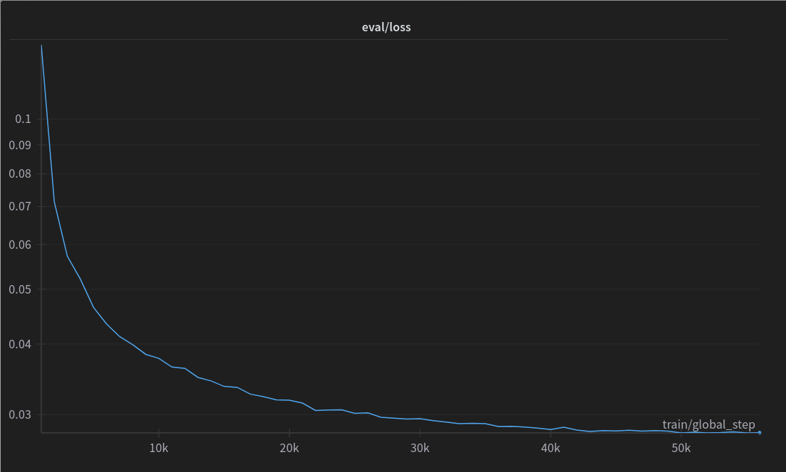

Aktualnie świat przetwarzania języka naturalnego został zdominowany przez rozwiązania oparte o modele w architekturze *transformers*. Różnorodność tych modeli praktycznie zdominowała każdy obszar NLP. Niezależnie jednak od architektury i przeznaczenia mają one wspólną cechę, mianowicie duże zapotrzebowanie na dobrej jakości dane, które wykorzystywane są do treningu tych modeli.

## Problem do rozwiązania

Skąd w takim razie wziąć dane? Oczywiście zależy to od konkretnego przypadku i przeznaczenia modelu. A dane, jak to dane, często zapisane są w różnych formatach, w tym jednym z najmniej przystępnych do automatycznego przetwarzania czyli *pdf*. Koncepcja zapisu w formacie *pdf* to przede wszystkim prezentacja zapisanej treści, aby w dowolnym czytniku na dowolnym urządzeniu, forma graficzna była taka sama. Jednak podczas automatycznego przetwarzania tych plików można napotkać na problemy z odczytem zawartości.

Przykładowy problem z tekstem, który występuje po odczytaniu złej jakości pliku *pdf*:

```text
Strona...Tytuł...%6%z%50%|.....Zdecydowana0większość0czerwonych.karłów$należy#do,typu,widmowego%M,%ale%zalicza^się^do^nich^także^wieleHgwiazdHpóźnychHpodtypówHtypuHwidmowegoHKHorazHrzadkoHwystępujące,,najsłabsze,gwiazdy,typu,L.,Maksimum%intensywności%emitowanego%światła%przypada%w%zakresie%światła%czerwonego%lub%nawet%bliskiej%podczerwieni.
```

Poprawna forma tego tekstu, to:

```text
Zdecydowana większość czerwonych karłów należy do typu widmowego M, ale zalicza się do nich także wiele gwiazd późnych podtypów typu widmowego K oraz rzadko występujące, najsłabsze gwiazdy typu L. Maksimum intensywności emitowanego światła przypada w zakresie światła czerwonego lub nawet bliskiej podczerwieni.
```

## Rozwiązanie problemu

Widząc wiele problemów, które są powtarzalne w dużej skali, opracowaliśmy metodę *zaszumiania* danych, które przypominają napotkane problemy. Metoda bazuje na prawdopodobieństwach warunkowych oraz odwzorowuje rozkład problemów z przetwarzanych masowo tekstów. Opracowany zbiór zawiera 1M tekstów, z których wylosowaliśmy 100k do procesu uczenia modelu *odszumiacza*.

## Uczenie odszumiacza

Wykorzystaliśmy pretrenowany bazowy model w architekturze T5 [allegro/plt5-base](https://huggingface.co/allegro/plt5-base), który wyuczyliśmy na problem oczyszczenia danych. Uczenie modelu trwało *5 godzin i 30 minut* na jednej karcie *NVIDIA GeForce RTX 4090*. Wykres *loss-function* dla zbioru ewaluacyjnego:



## Przykład działania

Wyuczony model oczywiście udostępniliśmy na naszym [huggingface](https://huggingface.co/radlab) w repozytorium [radlab/polish-denoiser-t5-base](https://huggingface.co/radlab/polish-denoiser-t5-base).

Wejściem do modelu jest tekst w postaci: `denoise: <tekst do odszumienia>.` Dla przykładu wyżej, jest to:

```text
denoise: Strona...Tytuł...%6%z%50%|.....Zdecydowana0większość0czerwonych.karłów$należy#do,typu,widmowego%M,%ale%zalicza^się^do^nich^także^wieleHgwiazdHpóźnychHpodtypówHtypuHwidmowegoHKHorazHrzadkoHwystępujące,,najsłabsze,gwiazdy,typu,L.,Maksimum%intensywności%emitowanego%światła%przypada%w%zakresie%światła%czerwonego%lub%nawet%bliskiej%podczerwieni.
```

Wyjście z modelu wygląda następująco:

```text
Zdecydowana większość czerwonych karłów należy do typu widmowego M, ale zalicza się do nich także wiele gwiazd późnych podtypów typu widmowego K oraz rzadko występujące, najsławsze gwiazdy typu L. Maksimum intensywności emitowanego światła przypada w zakresie światła czerwonego lub nawet bliskiej podczerwieni.
```

Przykładowy kod, który umożliwia odpalenie modelu dla tekstu z przytaczanego przykładu:

```python
from transformers import T5ForConditionalGeneration, T5Tokenizer

def do_inference(text, model, tokenizer):
    input_text = f"denoise: {text}"
    inputs = tokenizer.encode(
        input_text,
        return_tensors="pt",
        max_length=256,
        padding="max_length",
        truncation=True,
    )

    corrected_ids = model.generate(
        inputs,
        max_length=256,
        num_beams=5,
        early_stopping=True,
    )

    corrected_sentence = tokenizer.decode(corrected_ids[0], skip_special_tokens=True)
    return corrected_sentence

model = T5ForConditionalGeneration.from_pretrained("radlab/polish-denoiser-t5-base")
tokenizer = T5Tokenizer.from_pretrained("radlab/polish-denoiser-t5-base")

text_str = "Strona...Tytuł...%6%z%50%|.....Zdecydowana0większość0czerwonych.karłów$należy#do,typu,widmowego%M,%ale%zalicza^się^do^nich^także^wieleHgwiazdHpóźnychHpodtypówHtypuHwidmowegoHKHorazHrzadkoHwystępujące,,najsłabsze,gwiazdy,typu,L.,Maksimum%intensywności%emitowanego%światła%przypada%w%zakresie%światła%czerwonego%lub%nawet%bliskiej%podczerwieni."

print(do_inference(text_str, model, tokenizer))
```

Zapraszamy do korzystania, smacznego 🙂

---

> **Ochrona i sanitizacja promptów:** W potokach produkcyjnych do automatycznego maskowania i anonimizacji danych wrażliwych przed wysłaniem do modeli LLM sprawdź narzędzie [PII Masker](/products/pii-masker/) oraz bramę [LLM Router](/products/llm-router/).
