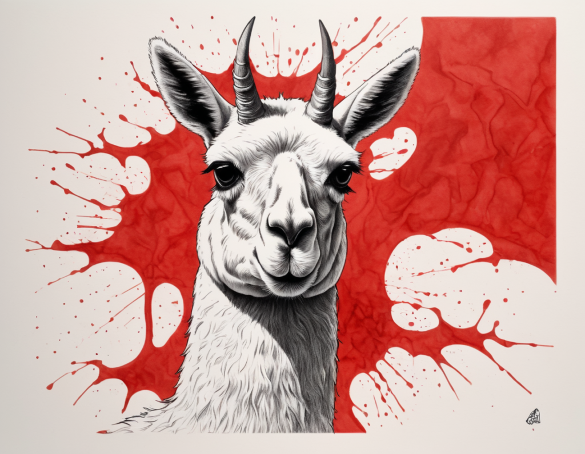
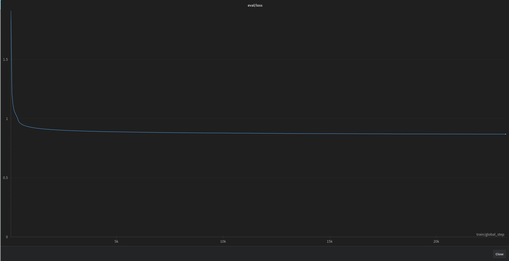
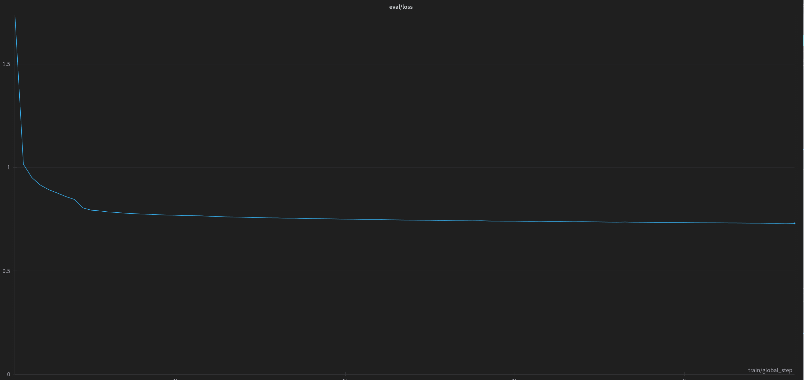

*pLLama – wygenerowane za pomocą AI*

## Intro

Witajcie!

W ostatnim [wpisie](https://radlab.dev/2024/08/04/rag-i-problemy/) wspominaliśmy o modelu GenaAI… Tak! Dzisiaj chcemy przedstawić Wam nasz nowy model, a właściwie to rodzinę modeli douczoną na język polski[: pLLama3-8B-chat](https://huggingface.co/radlab/pLLama3-8B-chat),[ pLLama3-8B-creator](https://huggingface.co/radlab/pLLama3-8B-creator) oraz [pLLama3-70B](https://huggingface.co/radlab/pLLama3-70B). Tym razem poszliśmy w kierunku douczania modeli od gigantów aby lepiej radziły sobie z naszym językiem.

Na pierwszy strzał poszły [Llama-3-8B-Instruct](https://huggingface.co/meta-llama/Meta-Llama-3-8B-Instruct) oraz [Llama-3-70B-Instruct](https://huggingface.co/meta-llama/Meta-Llama-3-70B-Instruct) od Meta.ai. Jest to model instrukcji, który potrafi wykonywać polecenia zadane w prompt’cie do modelu. Oryginalny model nie radzi sobie za dobrze z językiem polskim. Czasami potrafi coś po polsku napisać, jednak ciężko jest na nim wymusić płynną komunikację w naszym języku. Co ciekawe, zaskakująco dobrze potrafi zrozumieć polskie polecenia, jednak nie potrafi skonstruować poprawnej odpowiedzi.

Modele w architekturze 8B udostępniamy w dwóch konfiguracjach:

- radlab/pLLama3-8B-creator , model który podaje dość krótkie, konkretne odpowiedzi na zapytania użytkownika;
- radlab/pLLama3-8B-chat – model, który jest wersją gadatliwą, odzwierciedlającą zachowanie oryginalnego modelu meta-llama/Meta-Llama-3-8B-Instruct.

## Dataset

Fakt, że oryginalny model potrafi rozumieć polskie polecenia był dla nas zapalnikiem do pracy nad modelem. Założyliśmy hipotezę, że wystarczy w takim razie odpowiednio douczyć warstwę językową, jak najmniej ingerując w warstwę instrukcji.

Ale, jak to w przypadku dużych modeli językowych bywa, pojawił się pierwszy problem. Skąd pozyskać dane (*szczególnie dostępnych jako zestawy instrukcji/konwersacji na czacie!*), aby było ich wystarczająco dużo oraz aby ich jakość była jak najlepsza? Dla języka polskiego, istnieje tak na prawdę jeden, publicznie dostępny zbiór danych do uczenia modelu instrukcji, jest to [alpaca-dolly-chrisociepa-instruction-only-polish](https://huggingface.co/datasets/Lajonbot/alpaca-dolly-chrisociepa-instruction-only-polish). Jednak wielkość tego zbioru, nie pozwalała na dostateczne douczenie modelu.

W związku z tym, opracowaliśmy metodę tworzenia zbioru danych w strukturze instrukcji, korzystając z innych, dostępnych w sieci datasetów. Opracowaliśmy zestaw około 650k instrukcji w języku polskim, którymi nakarmiliśmy model podczas uczenia.

Dodatkowo, opracowaliśmy zbiór uczący do procesu DPO, który zawierał 100k przykładów, w których uczyliśmy model wybierać poprawnie zapisane wersje tekstów od tych, które zawierają błędy językowe. Przykłady uczące do DPO zawierały poprawnie zapisaną formę językową (*chosen*) oraz niepoprawnie zapisaną formę (*rejected*) tego samego tekstu. Warto zaznaczyć, że danych do DPO budowany był wstecznie — mianowicie dla bardzo dobrej jakości tekstów (*chosen*), przygotowaliśmy ich odpowiednik zaśmiecony (*rejected*).

## Proces uczenia

Proces uczenia podzielony był na dwa etapy:

- Dotrenowywanie ( FT ) na zbiór 650k instrukcji w języku polskim, czas fine-tuningu ustawiony był na 5 epok.
- Po etapie FT, dotrenowaliśmy model za pomocą DPO na 100k instrukcji poprawnego pisanie po polsku, w tym przypadku ustawiliśmy czas uczenia na 15k kroków.

Douczanie modelu na 650k miało na celu przeniesienie warstwy językowej dotrenowywanego modelu w stronę języka polskiego. Niestety ze względu na **nieidealny** zbiór instrukcji

> *ciekawostka*: zbiór instrukcji, generowany był w ~95% automatycznie — wykorzystując wczesną formę uczonego modelu (*w architekturze 70B*)  iteracyjnie, do wspomagania tworzenia zbioru, który utworzyliśmy do uczenia tego modelu docelowego…

model zaczął faktycznie mówić po polsku i reagować na instrukcje, ale czasami popełniał dość sporo literówek. Dlatego postanowiliśmy dotrenować model w DPO. W DPO przede wszystkim chcieliśmy uzyskać poprawę warstwy językowej modelu w stosunku do modelu z FT. Optymalizacja polegała na uczeniu modelu wyboru poprawnej formy językowej, a odrzucaniu niepoprawnej.

Na poniższym wykresie przedstawiona jest funkcja straty podczas całego procesu uczenia (model 8B). Nagły spadek wartości na początku funkcji, może świadczyć o dość szybkim dostosowaniu modelu do języka polskiego. A cały, długotrwały proces uczenia, to de facto poprawianie już szczegółów językowych.

Modele 8B uczyliśmy przez 5 epok, i cały proces uczenia trwał przez ponad 19d 14h na jednej karcie RTX 4090.

Szczegółowe metryki po skończonym fine-tuningu (model 8B):

| Metryka | Wartość |
| --- | --- |
| eval/loss | 0.8690009713172913 |
| eval/runtime | 464.5158 |
| eval/samples_per_second | 8.611 |
| total_flos | 46121863674517000000 |
| train_loss | 0.8724352801788304 |
| train_runtime | 1695168.0431 |
| train_samples_per_second | 1.758 |
| train/epoch | 5 |
| train/grad_norm | 0.17023593187332153 |
| train/learning_rate | 6.584723441615452e-8 |
| train/loss | 0.8293 |

Metryki po procesie uczenia (fine-tuningu)

---

Zaś metryki DPO przedstawiają się następująco:

- eval/logits/chosen: 0.1370937079191208
- eval/logits/rejected: 0.07430506497621536
- eval/logps/chosen: -454.11962890625
- eval/logps/rejected :-764.1261596679688
- eval/loss: 0.05717926099896431
- eval/rewards/accuracies: 0.9372459053993224
- eval/rewards/chosen: -26.75682830810547
- eval/rewards/margins: 32.37759780883789
- eval/rewards/rejected: -59.134429931640625
- eval/runtime: 1,386.3177
- eval/samples\_per\_second: 2.838
- eval/steps\_per\_second: 1.42

---

Na poniższym wykresie przedstawiona jest funkcja straty podczas całego procesu uczenia modelu w architekturze 70B.

Model 70B uczyliśmy również przez 5 epok, i cały proces uczenia trwał przez **ponad 1mo 5d** na jednej karcie RTX A6000 ADA 48GB, zaś metryki po skończonym fine-tuningu:

- eval/loss:0.7297297716140747
- eval/runtime:6,364.4589
- eval/samples\_per\_second:0.628
- eval/steps\_per\_second:0.628

## Co po uczeniu?

Nasze modele mają jedną, bardzo ciekawą cechę. W tej chwili potrafią przeczytać tekst w „dowolnym” języku, a odpowiedzieć po polsku. Dlatego jeden z nich, który nazwaliśmy [pLLama3-8B-creator](https://huggingface.co/radlab/pLLama3-8B-creator) zatrudniliśmy do pisania artykułów do pewnego projektu, o którym wkrótce. Inny z nich [pLLama3-8B-chat](https://huggingface.co/radlab/pLLama3-8B-chat) również ma tam swój udział 🙂 Enjoy!

## Huggingface

Oczywiście! Model udostępniamy za darmo na naszym [huggingface](https://huggingface.co/radlab). Poszczególne modele:

- radlab/pLLama3-8B-chat pod adresem https://huggingface.co/radlab/pLLama3-8B-chat
- radlab/pLLama3-8B-creator dostępny https://huggingface.co/radlab/pLLama3-8B-creator
- radlab/pLLama3-70B dostępny: https://huggingface.co/radlab/pLLama3-70B

---

Smacznego i na zdrowie! 🙂
