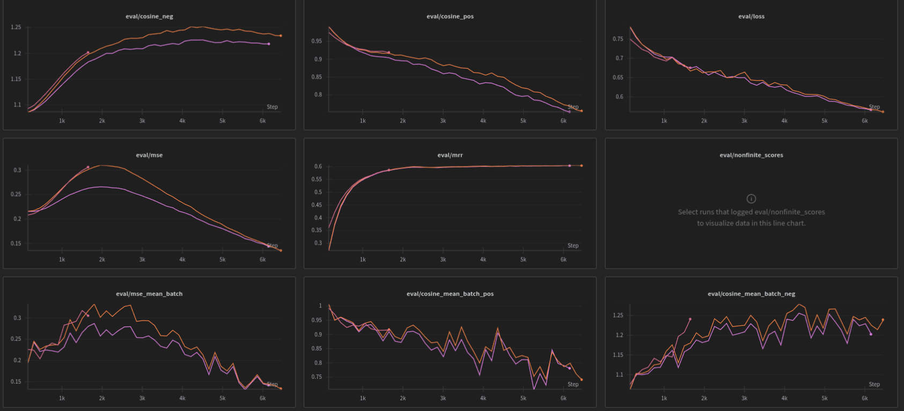
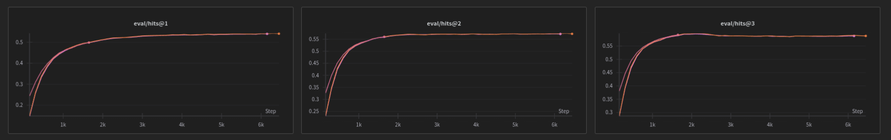

Witajcie! Dzisiaj technicznie. Ostatni miesiąc pracowaliśmy nad [publikacją](https://github.com/radlab-dev-group) części naszych rozwiązań. Dzisiaj chcielibyśmy przedstawić kilka z nich. Część, to działające mechanizmy na [playgroundzie](https://playground.radlab.dev/), a inne, to realizowane pomysły „z boku”. Wróciliśmy do pomysłu rozwijania rozwiązań całkowicie publicznie na Githubie. Dlatego zapraszamy na [nasz profil githubowy](https://github.com/radlab-dev-group), który krótko w tym wpisie przedstawiamy 😉

Poniżej przedstawiamy projekty z krótkimi opisami. Każdy z nich na [Githubie](https://github.com/radlab-dev-group) posiada dość obszerny plik README.

## [relgat-projector](https://github.com/radlab-dev-group/relgat-projector) („z boku”)

Repozytorium ([klik](https://github.com/radlab-dev-group/relgat-projector)) zawiera autorską implementację mechanizmów link-prediction na podstawie grafów semantycznych. Ideą było odtworzenie relacji semantycznych oraz możliwość tworzenia nowych reprezentacji bazując na istniejących. Zakładamy, że w grafie węzły posiadają opis semantyczny (np. za pomocą *embeddingu*), krawędzie nie posiadają opisu, jednak są rozróżnialne między sobą. *Labelka* *krawędzi* w takim grafie oznacza *nazwę relacji*.

Metoda umożliwia uczenie się macierzy przekształceń dla krawędzi w grafie, bazując na otoczeniu węzłów. Model jednocześnie uczy się przekształceń każdej relacji z osobna oraz uczy się definiować węzły na podstawie istniejących w grafie. Węzeł definiowany jest poprzez jego otoczenie (wejście), zakładamy, że to, co wchodzi do danego węzła, definiuje go. W odróżnieniu od standardowego RelGATa, nie uczymy się całej sieci — uczymy się przekształceń bazowej przestrzeni, do tej samej przestrzeni w taki sposób, że dla \[`A -> rel1 -> B`\], \[`C -> rel2 -> B`\] szukamy przekształceń `rel1` i `rel2` tak, aby kombinacja embeddingów `A` i `C` dały embedding `B`. Stosując dodatkowo ocenę przez metryki typu *hits@X* jako funkcje straty, dodatkowo uczymy się predykcji linków. Dzięki temu, możliwe będzie przetransformowanie dowolnego wektora `X `(z uczonej przestrzeni) za pomocą macierzy przekształceń `M` (np. aktywując określone relacje), w taki sposób, aby dostać wektor` X' `w tej samej przestrzeni, jednak po przekształceniu relacjami.

Przeprowadziliśmy już serię eksperymentów (na wykresach ostatnie stabilne treningi) i jak na razie (po wykresach) wygląda to obiecująco 😉

## [plwordnet](https://github.com/radlab-dev-group/plwordnet) („z boku”)

To repozytorium ([klik](https://github.com/radlab-dev-group/plwordnet)), za pomocą którego można operować na polskiej i angielskiej [Słowosieci](http://plwordnet.pwr.wroc.pl/wordnet/) (Słowosieć – polski, Princeton Wordnet – angielski). Co prawda nie służy ono aktualnie tylko do przeglądania Słowosieci, ale przede wszystkim jest to mechanizm to tworzenia zbiorów danych. Zaimplementowana jest tam metoda tworzenia embeddingów dla węzłów grafów semantycznych. Zawarty jest tam pełen proces od pobrania Słowosieci, przygotowania danych do dalszych procesów, aż do: tworzenia

- embeddera semantycznego,
- reprezentacji embeddingowych dla znaczeń Słowosieci i Princeton Wordnetu z wykorzystaniem tego embeddera.

Na [huggingface](https://huggingface.co/radlab) udostępniliśmy pierwszą wersję [modelu](https://huggingface.co/radlab/semantic-euro-bert-encoder-v1) ([radlab/semantic-euro-bert-encoder-v1](https://huggingface.co/radlab/semantic-euro-bert-encoder-v1)). To dwujęzyczny model embeddera, w którym jako model językowy wykorzystaliśmy [EuroBERT](https://huggingface.co/EuroBERT). Tworzenie reprezentacji embeddingowych to kilkuetapowy proces. Na początku reprezentacje tworzone są dla jednostek leksykalnych. Następnie, dla tych jednostek, dla których nie można było utworzyć reprezentacji, ale znajdują się w synsecie, w którym są jakieś reprezentacje, tworzona jest sztuczna (*fake*) reprezentacja dla jednostki. Po czym dla każdego synsetu, który posiada choć jedną reprezentację jednostki, tworzone są reprezentacje embeddingowe jako ważone, uśrednienie embeddingów jednostek. Po takiej operacji, nie wszystkie jednostki i synsety posiadają definicje, dlatego [relgat-projector](https://github.com/radlab-dev-group/relgat-projector) ma posłużyć między innymi do transformacji węzła bez reprezentacji, jednak posiadającego jakieś otoczenie (synset lub jednostka).

## [ml-utils („z boku”)](https://github.com/radlab-dev-group/ml-utils)

Wcześniejsze biblioteki mają zależność do [ml-utils](https://github.com/radlab-dev-group/ml-utils). Jest to biblioteka, która upraszcza potok przetwarzania w kontekście uczenia maszynowego. Zawiera ogólne klasy i metody, które niezależne są od projektu, jednak ich funkcjonalność może być współdzielona do innych projektów. Za pomocą [ml-utils](https://github.com/radlab-dev-group/ml-utils) można między innymi:

- w prosty sposób zarządzać logowaniem wyników do Weights & Biases,
- zarządzać promptami do modeli generatywnych, poprzez nazwy wynikające ze struktury katalogów,
- obsługiwać dowolne api modelu generatywnego zgodne z OpenAPI, tworzyć kolejki oraz cache’ować odpowiedzi dla zmniejszenia liczby odpytań modelu.

Dodatkowo dostępne są moduły ogólnego przeznaczenia, takie jak parsowanie *envów* czy tworzenie ujednoliconych *loggerów*, ale znajduje się tam również moduł do pobierania danych z [Wikipedii](https://github.com/radlab-dev-group/ml-utils/blob/main/rdl_ml_utils/utils/wikipedia.py), który wykorzystywany jest w [plwordnet](https://github.com/radlab-dev-group/plwordnet) do wzbogacenia kontekstu budowanych embeddingów.

## [Moduły z playgroundu](https://playground.radlab.dev/)

W repozytorium [clusterer](https://github.com/radlab-dev-group/clusterer) zamieściliśmy moduł odpowiadający za tworzenie klastrów na [playgroundzie](https://playground.radlab.dev/). Typy informacji, które widoczne są w *[Przeglądarce Informacji](https://radlab.dev/2025/05/28/przegladarka-informacji/)* czy też w *[Eksploratorze informacji](https://radlab.dev/2025/07/14/eksplorator-informacji-nie-mlotek-a-skalpel/)* są tworzone właśnie za pomocą tego modułu. Dokładniejszy opis metody zamieściliśmy na blogu w podlinkowanych artykułach. Oprócz tego, udostępniliśmy kod do [wizualizatora grafów](https://github.com/radlab-dev-group/graph-visualizer), który aktualnie uruchomiony jest pod adresem [https://graph.playground.radlab.dev/](https://graph.playground.radlab.dev/) gdzie prezentowane są grafy informacyjne ciągłe i nieciągłe. Oprócz tego, do kolekcji dołączyliśmy repozytorium [radlab-playground-ui](https://github.com/radlab-dev-group/radlab-playground-ui) z kodem interfejsu [Playgroundu](https://playground.radlab.dev/), jako aplikacji w streamlicie.

## Zakończenie

Wszystkie kody udostępniamy na otwartej licencji [Apache 2.0](https://www.apache.org/licenses/LICENSE-2.0), można dowolnie wykorzystywać – komercyjnie i niekomercyjnie. Koniec. 😉
